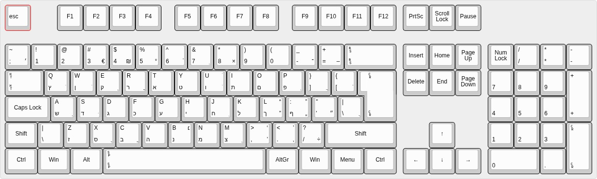

# Universal Keyboard Reference Image Creation Tool (*UKRIT*)

UKRIT is a tool designed to create reference images for various keyboard layouts. It allows users to generate images that display the layout of keys on a keyboard, which can be useful for documentation, educational purposes, or software development.

## Features

- Supports multiple keyboard layouts
- Customizable key labels
- Generates high-quality images
- Automatic layout detection
- Supports various output formats (PNG, SVG, etc.)

## Problem Statement
UKRIT aims to solve the problem of creating accurate and visually appealing keyboard layout images. Many existing tools either lack customization options or do not support all keyboard layouts, leading to inconsistencies and inaccuracies in documentation and educational materials. Furthermore, tools that allow for exporting do not provide a readable resolution, making it difficult to use these images in various contexts.

> Image showing the problem with current tools

As shown in the image, current tools often produce images that while being good for the majority of layouts, fail to accurately represent certain layouts with smaller keys or unique arrangements such as the niqqud in Hebrew keyboards. UKRIT addresses this by allowing users to create custom layouts with precise key dimensions and arrangements.